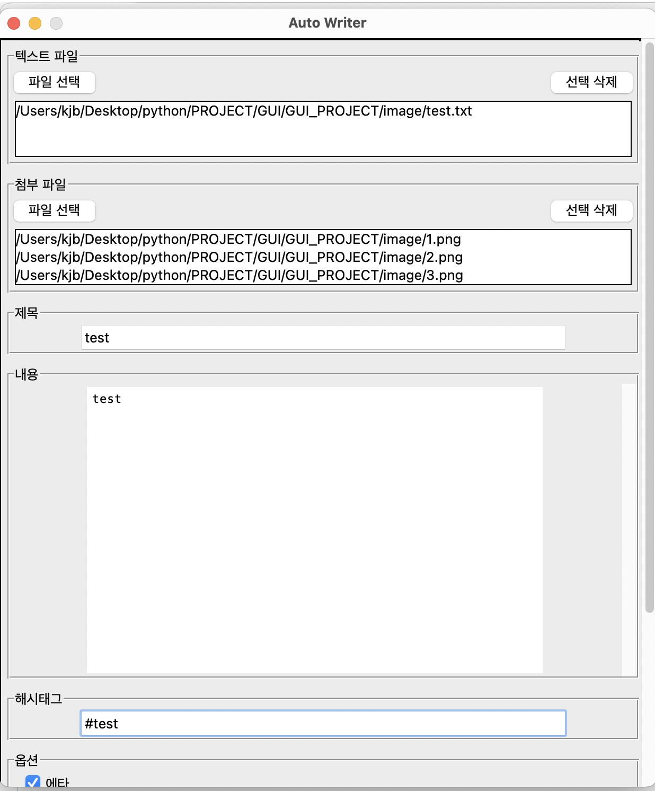
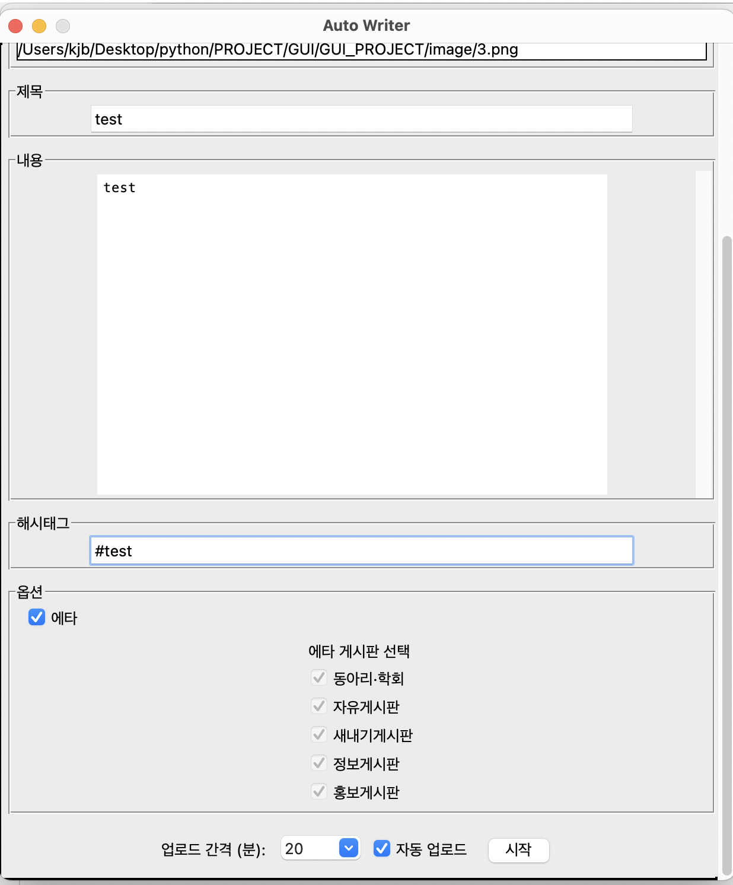
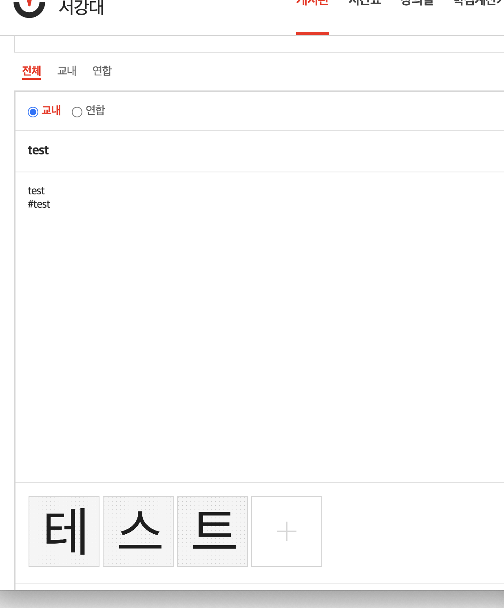
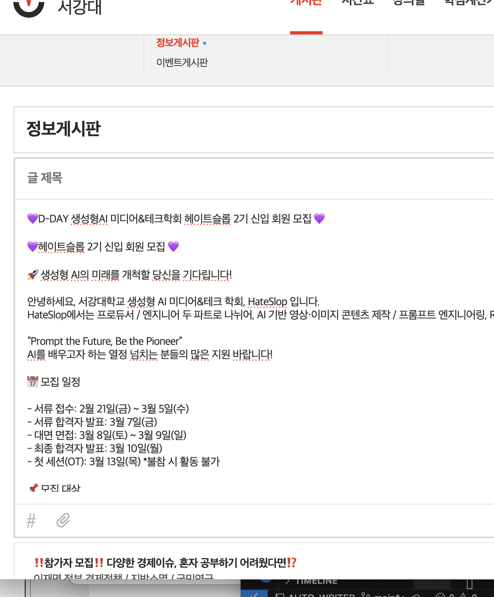

# 📣 AUTO_WRITER: 자동 학회 홍보글 업로드 시스템

에타(Everytime)와 같은 학내 커뮤니티에 반복적으로 게시글을 업로드하는 작업을 자동화하는 Python 기반의 GUI 프로그램입니다.  
오타 없이, 빠르고 정확하게 게시글을 작성하고 싶은 학회/동아리 운영진을 위한 필수 툴입니다.

---

## ✨ 주요 기능

- 🧠 **자동 로그인 쿠키 저장**: 수동 로그인 없이 자동화된 접근 가능  
- 📝 **GUI 기반 글쓰기**: 파일 불러오기만으로 손쉽게 업로드  
- 🚀 **즉시 업로드**: 클릭 한 번으로 글 작성 및 게시 완료  
- ⏰ **자동화**: 정해놓은 시간마다 반복적으로 업로드 가능 
- 🧪 **확장 가능 구조**: 서담(서울대 커뮤니티) 등 다른 플랫폼도 지원 예정  

---

## 🖼️ 실행 화면

  



---

## 🛠️ 사용 방법

1. `get_login_cookies.py` 실행 후 브라우저에서 Everytime 로그인 → 쿠키 자동 저장  
2. `main.py` 실행 → GUI에서 게시글 파일 선택 후 업로드  

---

## 📌 설치 및 실행

```bash
git clone https://github.com/Beanssssssss/AUTO_WRITER.git
cd AUTO_WRITER
pip install -r requirements.txt
python get_login_cookies.py
python main.py
```

## 👀텍스트 이모티콘 포함 시 추가구현

```bash
text_area.clear()
driver.execute_script("""
    arguments[0].value = arguments[1];
    arguments[0].dispatchEvent(new Event('input', { bubbles: true }));
    arguments[0].dispatchEvent(new Event('change', { bubbles: true }));
""", text_area, content)
```